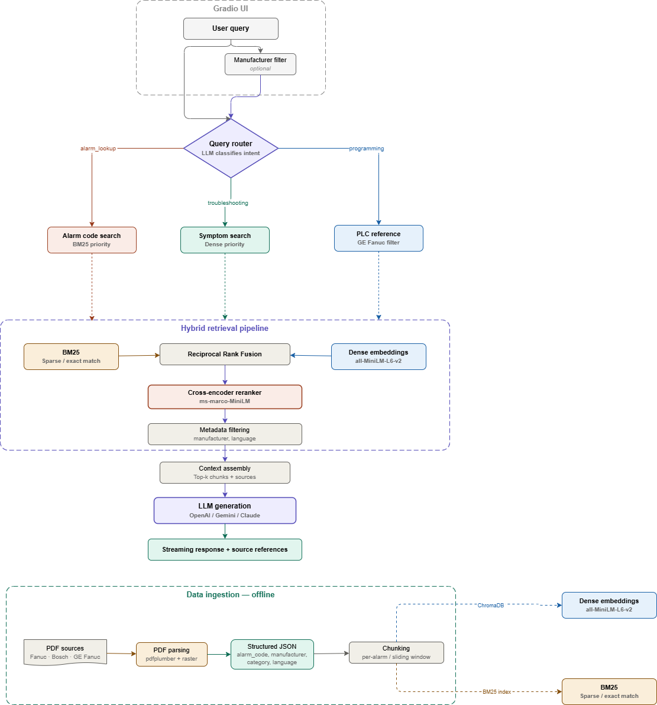

# FaultPilot V01

## Project description

FaultPilot is an OT troubleshooting assistant for industrial maintenance teams.
It combines intent routing, hybrid retrieval (BM25 + dense + rerank), and citation-grounded answer generation in a Gradio UI designed for operator workflows.

## Public project links

- Hugging Face Space: `https://huggingface.co/spaces/jmartinezsegulagrp/faultpilot-v01`
- GitHub repository: `https://github.com/JorgeDSprojects/FaultPilot_V01`

## Domain adaptation overview

FaultPilot adapts the course RAG baseline into an OT-focused assistant for real maintenance workflows:

- Routes queries by intent (`alarm_lookup`, `troubleshooting`, `programming`) to use route-specific retrieval profiles.
- Applies manufacturer/equipment metadata filters so operators can narrow answers to the active machine.
- Uses PDF parsing pipelines that normalize industrial manuals into structured JSONL chunks with source/page traceability.

Architecture reference used for the adaptation:



## Run locally

```bash
uv sync
uv run python app.py
```

Optional settings override:

Windows PowerShell:

```powershell
$env:FAULTPILOT_SETTINGS_PATH = "path\\to\\settings.yaml"
uv run python app.py
```

Linux/macOS shell:

```bash
export FAULTPILOT_SETTINGS_PATH="path/to/settings.yaml"
uv run python app.py
```

## Required API keys

- Provider-backed grounded answer generation requires an OpenAI API key entered in the UI (`OpenAI API Key` password field).

Key handling statement:
- Each user supplies the key in the UI (`OpenAI API Key` password field) for the active session.
- FaultPilot uses the key in memory for request execution and does not store it in project files, repository config, or persistent application storage.

## Quick cost estimate (`gpt-4o-mini`)

- Certification smoke run example: 20 troubleshooting questions, each around <=1000 prompt tokens and <=500 completion tokens.
- Estimated total is well under **$0.50** with `gpt-4o-mini` (typically only a few cents, depending on prompt length and retries).

## Optional functionalities

Implemented optional techniques (course list wording):

- Implement streaming responses.
- The app is designed for a specific goal/domain that is not a tutor about AI.
- You have shown evidence of collecting at least two data sources beyond those provided in our course.
- Your data collection and curation process leverages structured JSON outputs, which are used for advanced RAG functionalities in your app.
- Your data collection and curation process leverages images and/or PDFs.
- Use a reranker in your RAG pipeline.
- Use hybrid search in your RAG pipeline.
- Use metadata filtering.
- Your RAG pipeline includes query routing.

Notes on evidence:

- Data sources used in current pipeline: `ac_spindle_alarm_list.pdf` and `Error_messages_CC_220107007331804.pdf`.
- Structured outputs: `data/processed/fanuc_ac_spindle_chunks.jsonl` and `data/processed/bosch_cc220_chunks.jsonl`.
- Routing/retrieval logic lives in `faultpilot/routing/` and `faultpilot/retrieval/`.

## Deploy on Hugging Face Spaces

1. Create a new Space with SDK set to `gradio`.
2. Keep `app.py` and `requirements.txt` at repository root.
3. Confirm Python runtime is `3.10+`.
4. The current runtime does not consume an `OPENAI_API_KEY` Space secret; users enter the key in the UI per session.
5. Push the repository and wait for the build to complete.

Public Space URL:
- `https://huggingface.co/spaces/jmartinezsegulagrp/faultpilot-v01`

After each push, Spaces installs dependencies from `requirements.txt` and launches `app.py` automatically.

## Dependency sync rule

- Source of truth for runtime dependencies is `[project.dependencies]` in `pyproject.toml`.
- `requirements.txt` exists for Hugging Face Spaces compatibility and must stay in exact sync with `pyproject.toml` in every dependency-changing PR.
